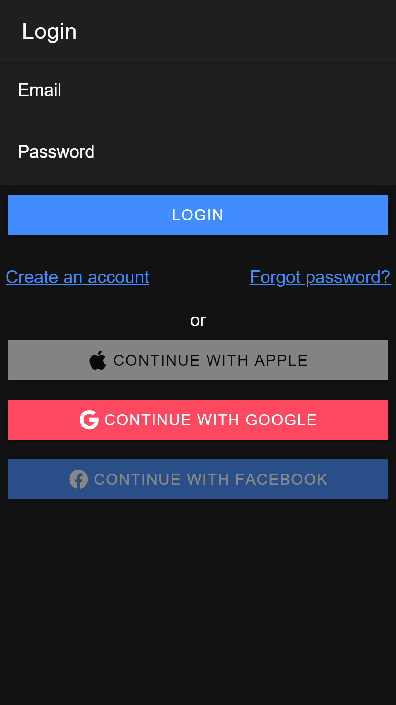

# LOGIN WITH FIREBASE

## Simple login authentication, with firebase, google and custom email and password.

# Screenshots
| Login      | Register      | Forgot password       |
|------------|-------------|-------------|
|  |  |  |

| Verify Email      | Admin Panel      |
|-------------|-------------|
|  |  |

# Ionic CLI commands and TODO
## Create a project with [firebase console](http://firebase.com/) then...
1. ionic start ionic-login-firebase blank --type=angular
2. npm i firebase
3. ng add @angular/fire
4. ionic generate page login
5. ionic generate page register
6. ionic generate page admin
7. ionic generate page verify-email
8. ionic generate page forgot-password
9. ionic generate service services/auth
10. ionic generate guard auth
11. ionic generate guard isLogged

